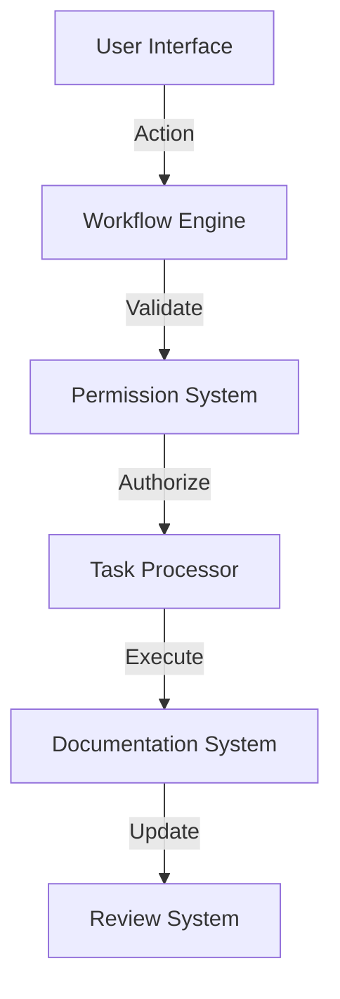

# Phase 4 Implementation Specifications: Clinical Workflow Layer

## 1. Role-Based Access System

### 1.1 Role Definitions
```typescript
interface UserRole {
  id: string;
  name: 'doctor' | 'nurse' | 'pa';
  permissions: Permission[];
  customViews: ViewConfiguration[];
}

interface Permission {
  resource: string;
  actions: ('read' | 'write' | 'delete')[];
  constraints?: {
    timeRestriction?: string;
    departmentLimit?: string[];
  };
}
```

### 1.2 View Customization
```typescript
interface ViewConfiguration {
  layout: 'summary' | 'detailed' | 'compact';
  priorityItems: string[];
  defaultFilters: Record<string, unknown>;
  quickActions: QuickAction[];
}

interface QuickAction {
  id: string;
  label: string;
  type: 'button' | 'link';
  action: string;
  requiredPermissions: string[];
}
```

## 2. Clinical Workflows

### 2.1 Morning Rounds
```typescript
interface RoundSession {
  id: string;
  date: string;
  doctor: string;
  patients: PatientRound[];
  status: 'planned' | 'in_progress' | 'completed';
  notes: RoundNote[];
}

interface PatientRound {
  patientId: string;
  order: number;
  status: 'pending' | 'seen' | 'skipped';
  plannedDuration: number;
  actualDuration?: number;
  vitals: VitalSigns;
  tasks: RoundTask[];
}
```

### 2.2 Follow-up Management
```typescript
interface FollowUp {
  id: string;
  patientId: string;
  type: 'routine' | 'urgent' | 'post_procedure';
  scheduledDate: string;
  assignedTo: string;
  status: 'scheduled' | 'completed' | 'missed';
  prerequisites: Prerequisite[];
}

interface Prerequisite {
  type: 'test' | 'consultation' | 'medication';
  description: string;
  status: 'pending' | 'completed';
  dueDate: string;
}
```

## 3. Communication System

### 3.1 Team Messaging
```typescript
interface Message {
  id: string;
  sender: string;
  recipients: string[];
  priority: 'normal' | 'urgent' | 'critical';
  content: string;
  attachments: Attachment[];
  metadata: {
    patientContext?: string;
    caseReference?: string;
    requiredAction?: boolean;
  };
}
```

### 3.2 Task Management
```typescript
interface ClinicalTask {
  id: string;
  title: string;
  description: string;
  assignedBy: string;
  assignedTo: string[];
  priority: 'low' | 'medium' | 'high' | 'critical';
  dueDate: string;
  status: 'new' | 'in_progress' | 'completed' | 'blocked';
  patientId?: string;
  category: 'documentation' | 'followup' | 'procedure' | 'consultation';
}
```

## 4. Documentation Review System

### 4.1 Review Process
```typescript
interface DocumentReview {
  id: string;
  documentId: string;
  reviewerId: string;
  status: 'pending' | 'in_review' | 'approved' | 'rejected';
  comments: ReviewComment[];
  metadata: {
    version: string;
    timeSpent: number;
    completeness: number;
  };
}

interface ReviewComment {
  id: string;
  section: string;
  content: string;
  type: 'correction' | 'suggestion' | 'question';
  resolved: boolean;
}
```

## 5. Implementation Guidelines

### 5.1 Data Flow


### 5.2 State Management
```typescript
interface WorkflowState {
  currentUser: UserRole;
  activePatients: string[];
  pendingTasks: ClinicalTask[];
  openDocuments: DocumentReview[];
  activeAlerts: Alert[];
}
```

### 5.3 Error Handling
```typescript
interface WorkflowError {
  code: string;
  context: {
    workflow: string;
    step: string;
    user: string;
  };
  severity: 'warning' | 'error' | 'critical';
  resolution: {
    type: 'retry' | 'escalate' | 'bypass';
    instructions: string;
  };
}
```

## 6. Security & Compliance

### 6.1 Audit Trail
```typescript
interface AuditEntry {
  timestamp: string;
  user: string;
  action: string;
  resource: string;
  outcome: 'success' | 'failure';
  metadata: {
    ip: string;
    device: string;
    location: string;
  };
}
```

### 6.2 Access Control
```typescript
interface AccessPolicy {
  role: string;
  resources: string[];
  conditions: {
    timeWindow?: string[];
    location?: string[];
    deviceType?: string[];
  };
  restrictions: {
    maxAttempts: number;
    requiresMFA: boolean;
    ipWhitelist?: string[];
  };
}
```

## 7. Performance Optimization

### 7.1 Caching Strategy
```typescript
interface CacheConfig {
  resource: string;
  ttl: number;
  strategy: 'memory' | 'persistent';
  invalidation: {
    onUpdate: boolean;
    onAccess: boolean;
    maxAge: number;
  };
}
```

### 7.2 Load Balancing
```typescript
interface LoadConfig {
  maxConcurrent: number;
  priorityLevels: Record<string, number>;
  backoffStrategy: {
    initial: number;
    multiplier: number;
    maxRetries: number;
  };
}
```

## 8. Integration Testing

### 8.1 Test Scenarios
```typescript
interface WorkflowTest {
  name: string;
  steps: TestStep[];
  expectedOutcome: {
    state: Partial<WorkflowState>;
    documents: string[];
    notifications: string[];
  };
}

interface TestStep {
  action: string;
  input: Record<string, unknown>;
  validation: {
    state: string[];
    timing: number;
    artifacts: string[];
  };
}
```

