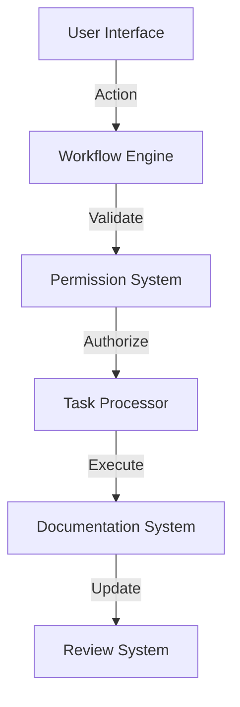

# Phase 4: Clinical Workflow Layer

This directory contains the implementation specifications for the Clinical Workflow Layer, split into focused modules:

1. [Roles](./ROLES.md) - Role-based access system and view customization
2. [Workflows](./WORKFLOWS.md) - Clinical workflows including morning rounds and follow-ups
3. [Communication](./COMMUNICATION.md) - Team messaging and task management
4. [Documentation](./DOCUMENTATION.md) - Documentation review system
5. [Security](./SECURITY.md) - Security and compliance specifications
6. [Performance](./PERFORMANCE.md) - Performance optimization strategies
7. [Testing](./TESTING.md) - Integration testing specifications

## Data Flow


## State Management
```typescript
interface WorkflowState {
  currentUser: UserRole;
  activePatients: string[];
  pendingTasks: ClinicalTask[];
  openDocuments: DocumentReview[];
  activeAlerts: Alert[];
}
```

## Error Handling
```typescript
interface WorkflowError {
  code: string;
  context: {
    workflow: string;
    step: string;
    user: string;
  };
  severity: 'warning' | 'error' | 'critical';
  resolution: {
    type: 'retry' | 'escalate' | 'bypass';
    instructions: string;
  };
}
```
