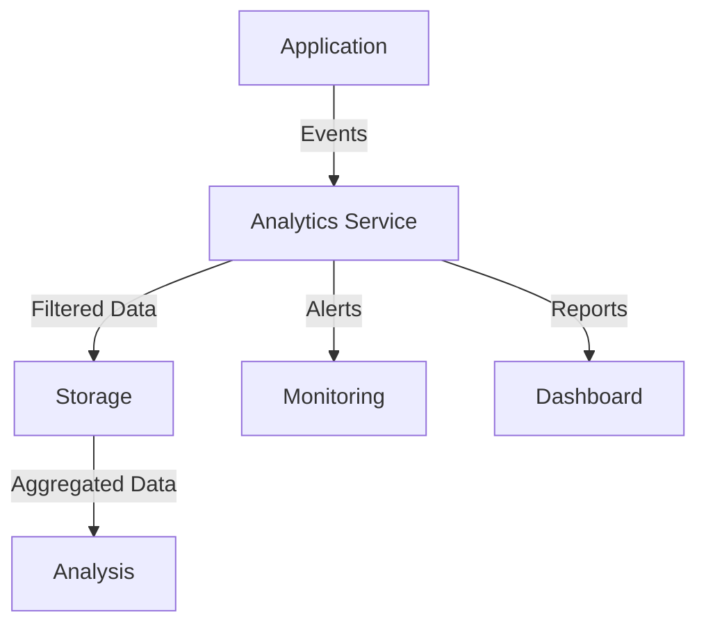

# Analytics Implementation Strategy

## Overview
This document outlines the analytics implementation strategy for the Cardiology Clinical Assistant, ensuring HIPAA compliance while providing valuable insights into system usage and performance.

## 1. Event Tracking Architecture

### 1.1 Event Structure
```typescript
interface AnalyticsEvent {
  eventId: string;
  category: 'user' | 'clinical' | 'system' | 'security';
  action: string;
  timestamp: string;
  metadata: {
    sessionId?: string;
    userRole?: string;
    patientId?: string; // Hashed
    component?: string;
    duration?: number;
  };
  context: {
    environment: string;
    version: string;
    userAgent: string;
  };
}
```

### 1.2 Event Categories
1. **User Events**
   - Login/Logout
   - Feature Usage
   - Navigation Patterns
   - Template Selection
   - Documentation Creation

2. **Clinical Events**
   - Document Completion
   - Template Usage
   - Patient Interactions
   - Clinical Decision Points

3. **System Events**
   - Performance Metrics
   - Error Occurrences
   - API Latency
   - Resource Utilization

4. **Security Events**
   - Access Attempts
   - Permission Changes
   - Data Export Events
   - Security Alerts

## 2. HIPAA Compliance

### 2.1 Data Protection
- PHI Anonymization
- Data Encryption
- Access Controls
- Audit Logging

### 2.2 Data Collection Rules
```typescript
interface DataCollectionPolicy {
  dataType: string;
  allowed: boolean;
  anonymizationRequired: boolean;
  retentionPeriod: string;
  accessControls: {
    roles: string[];
    purposes: string[];
    restrictions: string[];
  };
}
```

### 2.3 Compliance Checklist
- [x] PHI Identification
- [x] Data Minimization
- [x] Access Controls
- [x] Audit Trails
- [x] Encryption Standards
- [x] Retention Policies

## 3. Event Collection Pipeline

### 3.1 Collection Process


### 3.2 Data Flow
1. Event Generation
2. Privacy Filtering
3. Data Enrichment
4. Batch Processing
5. Secure Storage
6. Analysis Pipeline

## 4. Performance Metrics

### 4.1 System Performance
```typescript
interface PerformanceMetrics {
  pageLoadTime: number;
  apiLatency: number;
  resourceUtilization: {
    cpu: number;
    memory: number;
    network: number;
  };
  errorRates: {
    count: number;
    type: string;
    impact: string;
  };
}
```

### 4.2 User Experience Metrics
- Time to Interactive
- Feature Adoption Rates
- Task Completion Time
- Error Recovery Time
- User Satisfaction Scores

## 5. Usage Reporting

### 5.1 Report Types
1. **Daily Operations**
   - Active Users
   - Document Creation
   - Template Usage
   - Error Rates

2. **Clinical Insights**
   - Documentation Patterns
   - Template Effectiveness
   - Clinical Workflows
   - Decision Support Usage

3. **Compliance Reports**
   - Access Logs
   - Data Export History
   - Security Events
   - Policy Adherence

### 5.2 Report Structure
```typescript
interface AnalyticsReport {
  reportId: string;
  type: 'daily' | 'weekly' | 'monthly' | 'custom';
  metrics: {
    name: string;
    value: number;
    trend: number;
    threshold?: number;
  }[];
  insights: {
    category: string;
    description: string;
    recommendations: string[];
  }[];
  metadata: {
    generated: string;
    timeframe: string;
    filters: Record<string, unknown>;
  };
}
```

## 6. Implementation Guidelines

### 6.1 Event Tracking
```typescript
// Example implementation
const trackEvent = (event: AnalyticsEvent): void => {
  const sanitizedEvent = sanitizeEvent(event);
  if (validateHIPAACompliance(sanitizedEvent)) {
    queueEvent(sanitizedEvent);
  }
};
```

### 6.2 Best Practices
1. Minimize PHI Collection
2. Implement Data Lifecycle
3. Regular Compliance Audits
4. Performance Optimization
5. Real-time Monitoring

## 7. Integration Points

### 7.1 System Integration


### 7.2 External Systems
- EMR Integration
- Compliance Systems
- Reporting Tools
- Monitoring Services

## 8. Security Controls

### 8.1 Access Management
```typescript
interface AnalyticsAccess {
  role: string;
  permissions: {
    view: string[];
    export: string[];
    configure: string[];
  };
  restrictions: {
    dataTypes: string[];
    timeframes: string[];
    purposes: string[];
  };
}
```

### 8.2 Audit Requirements
- Access Logging
- Data Modifications
- Export Activities
- Configuration Changes

## 9. Retention & Cleanup

### 9.1 Data Lifecycle
```typescript
interface RetentionPolicy {
  dataType: string;
  retention: {
    duration: string;
    basis: 'creation' | 'last_access' | 'compliance';
  };
  archival: {
    required: boolean;
    format: string;
    location: string;
  };
  deletion: {
    method: 'secure_erase' | 'anonymize' | 'archive';
    approval: string[];
  };
}
```

### 9.2 Cleanup Procedures
1. Identify Expired Data
2. Validate Dependencies
3. Archive if Required
4. Secure Deletion
5. Audit Trail Update

## 10. Monitoring & Alerts

### 10.1 Alert Configuration
```typescript
interface AnalyticsAlert {
  metric: string;
  threshold: number;
  condition: 'above' | 'below' | 'equals';
  window: string;
  severity: 'low' | 'medium' | 'high';
  channels: string[];
  template: string;
}
```

### 10.2 Response Procedures
1. Alert Detection
2. Impact Assessment
3. Notification
4. Resolution
5. Documentation

## 11. Testing Strategy

### 11.1 Test Cases
- Data Accuracy
- Privacy Controls
- Performance Impact
- Compliance Rules
- Integration Points

### 11.2 Validation
```typescript
interface AnalyticsValidation {
  testType: string;
  scenarios: {
    name: string;
    input: Record<string, unknown>;
    expected: Record<string, unknown>;
    compliance: string[];
  }[];
  frequency: string;
  owner: string;
}
```

## 12. Deployment Process

### 12.1 Release Checklist
- [ ] Privacy Impact Assessment
- [ ] Performance Testing
- [ ] Security Review
- [ ] Compliance Verification
- [ ] Documentation Update

### 12.2 Rollback Plan
1. Issue Detection
2. Impact Assessment
3. Rollback Decision
4. Execution Steps
5. Verification Process

