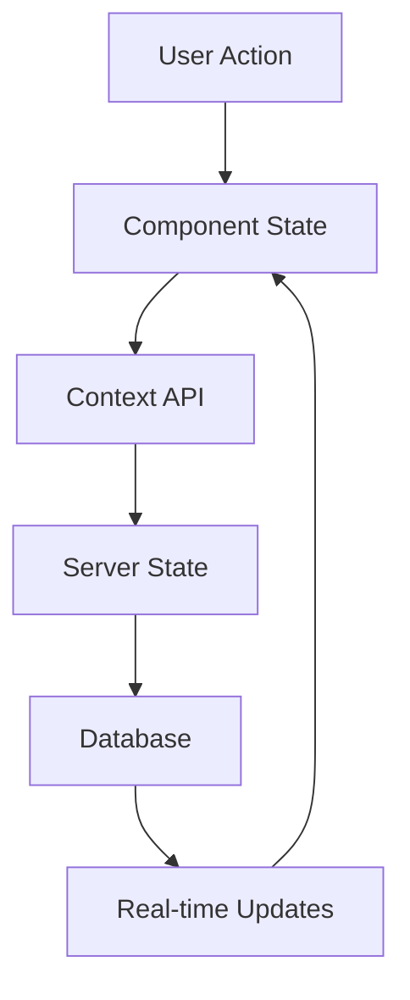

# Component Architecture

## Core Systems

### 1. Patient Context System
```
PatientContext/
├── PatientProvider/
│   ├── index.tsx
│   └── hooks/
│       ├── usePatientContext.ts
│       └── usePatientUpdates.ts
├── PatientInfo/
│   ├── index.tsx
│   ├── VitalsCard.tsx
│   └── InfoSection.tsx
├── VitalsDisplay/
│   ├── index.tsx
│   ├── VitalsChart.tsx
│   └── VitalsTable.tsx
├── MedicationTimeline/
│   ├── index.tsx
│   ├── TimelineView.tsx
│   └── MedicationCard.tsx
└── VisitHistory/
    ├── index.tsx
    ├── VisitList.tsx
    └── VisitDetails.tsx
```

### 2. Documentation System
```
Documentation/
├── NoteEditor/
│   ├── index.tsx
│   ├── EditorToolbar.tsx
│   └── hooks/
│       ├── useAutoSave.ts
│       └── useTemplateSync.ts
├── TemplateSelector/
│   ├── index.tsx
│   ├── TemplateList.tsx
│   └── TemplatePreview.tsx
├── VoiceInput/
│   ├── index.tsx
│   ├── RecordingControls.tsx
│   └── TranscriptionDisplay.tsx
└── ContextualSuggestions/
    ├── index.tsx
    ├── SuggestionList.tsx
    └── hooks/
        └── useSuggestions.ts
```

### 3. Clinical Intelligence System
```
ClinicalIntelligence/
├── TrendAnalysis/
│   ├── index.tsx
│   ├── TrendChart.tsx
│   └── AnalysisReport.tsx
├── PatternRecognition/
│   ├── index.tsx
│   ├── PatternList.tsx
│   └── PatternDetails.tsx
└── AlertSystem/
    ├── index.tsx
    ├── AlertsList.tsx
    └── AlertConfig.tsx
```

### 4. Integration Layer
```
Integration/
├── EMRConnector/
│   ├── index.tsx
│   ├── ConnectionStatus.tsx
│   └── SyncControls.tsx
├── ExternalServices/
│   ├── index.tsx
│   ├── ServicesList.tsx
│   └── ServiceConfig.tsx
└── DataMapping/
    ├── index.tsx
    ├── MappingRules.tsx
    └── ValidationDisplay.tsx
```

## Component Guidelines

### 1. State Management
- Use React Context for global state
- Implement custom hooks for complex state logic
- Leverage React Query for server state
- Utilize Supabase real-time updates where appropriate

### 2. Composition Pattern
```typescript
// Example of component composition
interface CompoundComponent {
  Root: React.FC<RootProps>;
  Header: React.FC<HeaderProps>;
  Content: React.FC<ContentProps>;
  Footer: React.FC<FooterProps>;
}

// Usage
const Component: CompoundComponent = {
  Root: ComponentRoot,
  Header: ComponentHeader,
  Content: ComponentContent,
  Footer: ComponentFooter
};
```

### 3. Performance Optimization
- Implement proper memoization
```typescript
const MemoizedComponent = memo(Component, (prevProps, nextProps) => {
  return isEqual(prevProps, nextProps);
});
```

- Use lazy loading for heavy components
```typescript
const HeavyComponent = lazy(() => import('./HeavyComponent'));
```

- Optimize re-renders with useMemo and useCallback
```typescript
const memoizedValue = useMemo(() => computeExpensiveValue(a, b), [a, b]);
const memoizedCallback = useCallback((param) => doSomething(param), []);
```

### 4. Error Boundaries
```typescript
class ComponentErrorBoundary extends React.Component<Props, State> {
  static getDerivedStateFromError(error: Error) {
    return { hasError: true, error };
  }

  componentDidCatch(error: Error, errorInfo: React.ErrorInfo) {
    logErrorToService(error, errorInfo);
  }

  render() {
    if (this.state.hasError) {
      return <ErrorFallback error={this.state.error} />;
    }
    return this.props.children;
  }
}
```

## Testing Strategy

### 1. Unit Tests
```typescript
describe('Component', () => {
  it('renders without crashing', () => {
    render(<Component />);
    expect(screen.getByRole('button')).toBeInTheDocument();
  });
});
```

### 2. Integration Tests
```typescript
describe('PatientFlow', () => {
  it('completes patient registration', async () => {
    render(<PatientRegistration />);
    // Test complete flow
  });
});
```

### 3. E2E Tests
- Use Playwright for critical paths
- Test main user journeys
- Validate integrations

## State Flow Diagram


## Implementation Guidelines

### 1. Component Creation
- Keep components focused and small
- Use TypeScript for all components
- Implement proper prop typing
- Follow naming conventions

### 2. Code Organization
- Group related components
- Separate business logic
- Maintain consistent file structure
- Use index files for exports

### 3. Documentation
- Add JSDoc comments
- Document props interfaces
- Include usage examples
- Maintain changelog

## Performance Monitoring

### 1. Key Metrics
- First Contentful Paint (FCP)
- Time to Interactive (TTI)
- Component render times
- Memory usage

### 2. Optimization Techniques
- Code splitting
- Tree shaking
- Asset optimization
- Caching strategies

