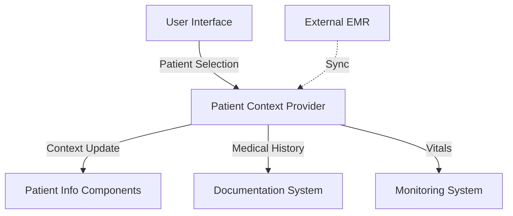
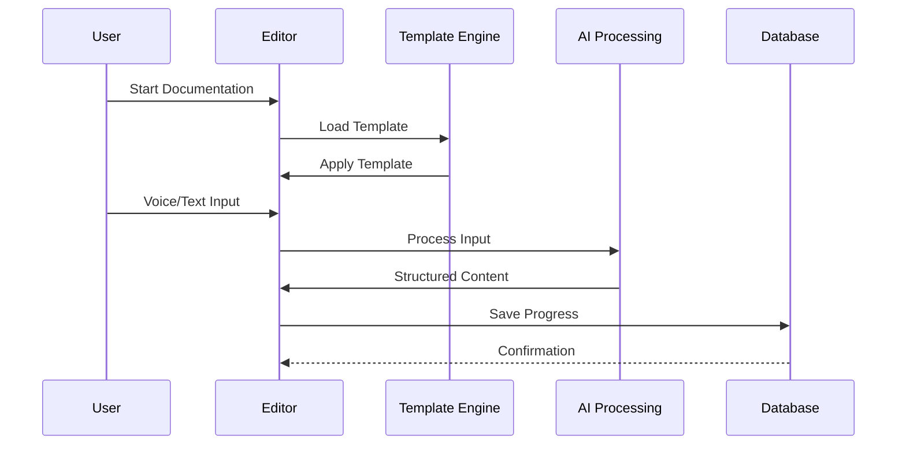
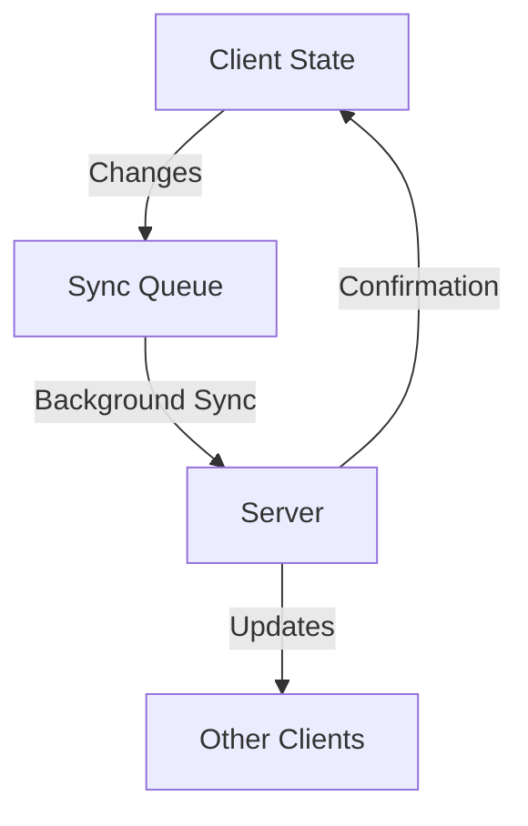
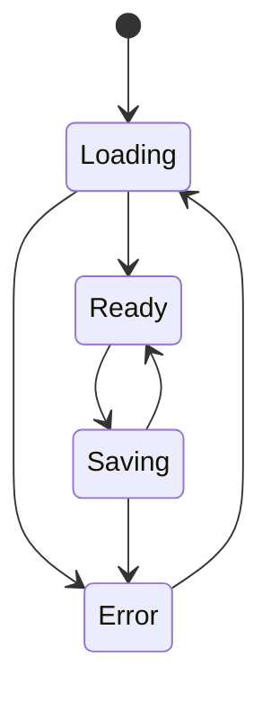

# Data Flow Architecture

## Overview
This document outlines the data flow patterns, real-time event handling, synchronization strategies, and caching mechanisms for the Cardiology Clinical Assistant.

## Core Data Flows

### 1. Patient Context Flow


### 2. Clinical Documentation Flow


## Real-time Event Handling

### 1. WebSocket Connections
- Dedicated channels for:
  - Patient vital updates
  - Documentation collaboration
  - Alert notifications
  - System status updates

### 2. Event Types
- **Clinical Events**
  - Vital sign updates
  - Medication changes
  - Test results
  - Alert triggers

- **System Events**
  - User presence
  - Document updates
  - Template changes
  - Integration status

### 3. Event Processing
```typescript
interface ClinicalEvent {
  type: 'vital' | 'medication' | 'test' | 'alert';
  patientId: string;
  timestamp: string;
  data: Record<string, unknown>;
  priority: 'low' | 'medium' | 'high' | 'critical';
}
```

## Data Synchronization

### 1. Offline Capabilities
- **Local Storage Strategy**
  - IndexedDB for patient data
  - Service Workers for offline access
  - Background sync for pending changes

- **Conflict Resolution**
  - Last-write-wins for non-critical data
  - Manual merge for conflicting clinical notes
  - Version tracking for templates

### 2. Sync Patterns


## Caching Strategy

### 1. Cache Layers
- **Browser Cache**
  - Static assets
  - UI components
  - Template definitions

- **Application Cache**
  - Patient context
  - Recent documents
  - User preferences

- **API Cache**
  - Query results
  - Template renderings
  - Validation rules

### 2. Cache Invalidation
```typescript
interface CacheConfig {
  type: 'patient' | 'template' | 'document';
  ttl: number; // Time to live in seconds
  invalidationRules: {
    onUpdate: boolean;
    onAccess: boolean;
    dependencies: string[];
  };
}
```

## Data States

### 1. Application States
- **Loading States**
  - Initial load
  - Data fetching
  - Processing
  - Saving

- **Error States**
  - Network errors
  - Validation errors
  - Processing errors
  - Authorization errors

### 2. State Management


## Performance Considerations

### 1. Data Loading
- Progressive data loading
- Prioritized content delivery
- Lazy-loaded components
- Prefetching based on user behavior

### 2. Optimization Strategies
```typescript
interface LoadingStrategy {
  priority: 'critical' | 'high' | 'normal' | 'low';
  loadingType: 'eager' | 'lazy' | 'on-demand';
  cacheStrategy: 'memory' | 'persistent' | 'none';
  prefetchRules?: {
    condition: string;
    threshold: number;
  };
}
```

## Security Measures

### 1. Data Protection
- End-to-end encryption for sensitive data
- Role-based access control
- Audit logging
- Data anonymization

### 2. Compliance
- HIPAA compliance
- Data retention policies
- Access controls
- Audit trails

## Error Handling

### 1. Error Types
```typescript
interface SystemError {
  code: string;
  type: 'network' | 'validation' | 'processing' | 'authorization';
  severity: 'low' | 'medium' | 'high' | 'critical';
  context: Record<string, unknown>;
  timestamp: string;
}
```

### 2. Recovery Strategies
- Automatic retry with backoff
- Fallback mechanisms
- Data recovery procedures
- User notification systems

## Monitoring and Logging

### 1. Metrics Collection
- Performance metrics
- Error rates
- User interactions
- System health

### 2. Logging Strategy
```typescript
interface LogConfig {
  level: 'debug' | 'info' | 'warn' | 'error';
  destination: 'console' | 'file' | 'service';
  retention: number; // Days to retain logs
  sensitiveFields: string[]; // Fields to redact
}
```

## Implementation Guidelines

### 1. Best Practices
- Use TypeScript for type safety
- Implement proper error boundaries
- Follow SOLID principles
- Maintain clear documentation

### 2. Code Organization
- Modular architecture
- Clear separation of concerns
- Consistent naming conventions
- Comprehensive testing

