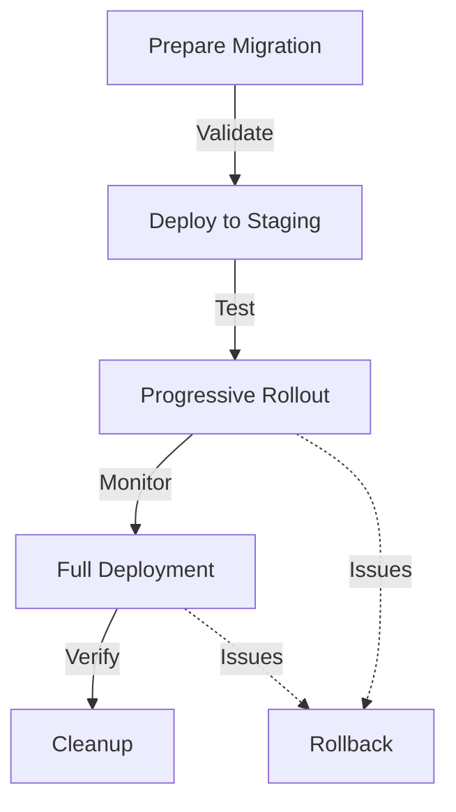

# Data Migration Plan

## Overview
This document outlines the strategy for evolving our database schema and managing data migrations while maintaining system availability and data integrity. The plan ensures zero-downtime migrations and proper validation of transformed data.

## 1. Schema Evolution Strategy

### 1.1 Migration Principles
- Zero-downtime deployments
- Backward compatibility
- Data integrity preservation
- Rollback capability
- Audit trail maintenance

### 1.2 Version Control
```typescript
interface SchemaVersion {
  version: number;
  description: string;
  appliedAt: string;
  appliedBy: string;
  status: 'pending' | 'in_progress' | 'completed' | 'failed' | 'rolled_back';
  rollbackPoint?: string;
}
```

### 1.3 Migration Types
1. **Additive Changes**
   - New table creation
   - Column addition
   - Index creation
   - Constraint addition

2. **Transformative Changes**
   - Data restructuring
   - Column type modifications
   - Relationship updates
   - Constraint modifications

3. **Destructive Changes**
   - Table removal
   - Column deletion
   - Constraint removal
   - Index removal

## 2. Zero-Downtime Migration Approach

### 2.1 Migration Phases
1. **Preparation Phase**
   - Schema validation
   - Capacity planning
   - Backup verification
   - Application compatibility check

2. **Deployment Phase**
   - Progressive rollout
   - Health monitoring
   - Performance tracking
   - Error detection

3. **Verification Phase**
   - Data consistency check
   - Application functionality test
   - Performance validation
   - Security audit

### 2.2 Rollout Strategy


## 3. Data Transformation Rules

### 3.1 Transformation Types
- **Type Conversions**
  - Date format standardization
  - Numeric precision adjustments
  - String format normalization
  - JSON structure updates

- **Data Enrichment**
  - Computed field generation
  - Reference data integration
  - Historical data backfill
  - Metadata enhancement

- **Data Consolidation**
  - Duplicate resolution
  - Record merging
  - Relationship reconciliation
  - Orphaned data cleanup

### 3.2 Validation Rules
```typescript
interface ValidationRule {
  field: string;
  type: 'format' | 'range' | 'reference' | 'custom';
  condition: string;
  errorMessage: string;
  severity: 'warning' | 'error';
  action: 'skip' | 'fail' | 'transform';
}
```

## 4. Implementation Guidelines

### 4.1 Migration Script Structure
```sql
-- Migration metadata
comment on migration '20240315_add_patient_vitals' is
  'Add vital signs tracking capability';

-- Validation pre-conditions
do $$
begin
  -- Verify schema state
  if exists_table('vital_signs') then
    raise exception 'Table vital_signs already exists';
  end if;
end $$;

-- Forward migration
create table vital_signs (
  id uuid primary key default gen_random_uuid(),
  patient_id uuid references patients(id),
  type varchar(50) not null,
  value numeric not null,
  unit varchar(20) not null,
  measured_at timestamp with time zone default now(),
  created_at timestamp with time zone default now(),
  updated_at timestamp with time zone default now()
);

-- Rollback script
-- drop table if exists vital_signs;
```

### 4.2 Data Validation Steps
1. **Pre-Migration Validation**
   - Schema compatibility
   - Data type compatibility
   - Constraint satisfaction
   - Reference integrity

2. **Migration Validation**
   - Record count verification
   - Data format validation
   - Relationship verification
   - Computed value accuracy

3. **Post-Migration Validation**
   - Application functionality
   - Data accessibility
   - Performance metrics
   - Security compliance

## 5. Error Handling & Recovery

### 5.1 Error Categories
```typescript
interface MigrationError {
  type: 'schema' | 'data' | 'performance' | 'security';
  severity: 'low' | 'medium' | 'high' | 'critical';
  description: string;
  impact: string[];
  resolution: string;
  rollbackRequired: boolean;
}
```

### 5.2 Recovery Procedures
1. **Immediate Recovery**
   - Transaction rollback
   - Schema restoration
   - Data restoration
   - Service restart

2. **Delayed Recovery**
   - Incremental fixes
   - Data reconciliation
   - Performance optimization
   - Monitor and verify

## 6. Monitoring & Reporting

### 6.1 Migration Metrics
- Success rate
- Duration
- Error count
- Performance impact
- Data volume
- Resource utilization

### 6.2 Health Indicators
```typescript
interface MigrationHealth {
  status: 'healthy' | 'degraded' | 'failed';
  metrics: {
    duration: number;
    errorRate: number;
    dataProcessed: number;
    resourceUsage: {
      cpu: number;
      memory: number;
      disk: number;
    };
  };
  alerts: {
    type: string;
    message: string;
    timestamp: string;
  }[];
}
```

## 7. Security Considerations

### 7.1 Data Protection
- Encryption requirements
- Access control
- Audit logging
- Data masking

### 7.2 Compliance
- HIPAA requirements
- Data retention
- Privacy protection
- Audit trail

## 8. Testing Strategy

### 8.1 Test Types
1. **Unit Tests**
   - Schema validation
   - Data transformation
   - Constraint verification
   - Performance benchmarks

2. **Integration Tests**
   - Application compatibility
   - API functionality
   - Data access patterns
   - Error handling

3. **Performance Tests**
   - Load testing
   - Stress testing
   - Recovery testing
   - Concurrency testing

### 8.2 Test Environments


## 9. Documentation Requirements

### 9.1 Migration Documentation
- Schema changes
- Data transformations
- Validation rules
- Rollback procedures
- Test results

### 9.2 Operational Documentation
- Deployment procedures
- Monitoring setup
- Alert responses
- Recovery processes
- Troubleshooting guides

