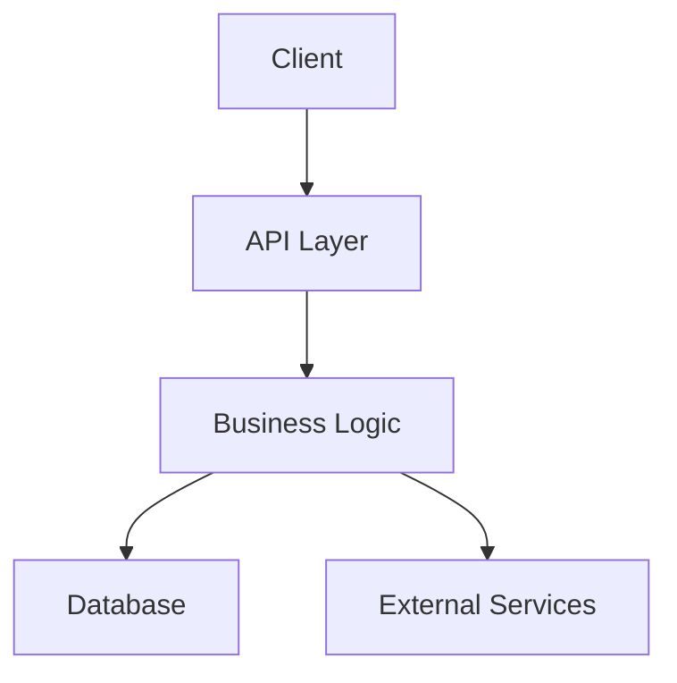
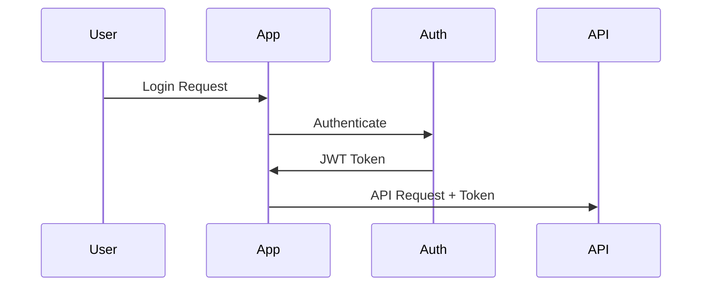

# Integration Patterns

## External System Integration

### EMR Systems
#### Allscripts Integration
- Data mapping patterns
- Authentication flow
- Error handling

### Lab Systems
- Results integration
- Order management
- Status tracking

## Internal Integration

### Component Communication
- Event patterns
- State management
- Error propagation

### Data Flow

## Authentication Flow

## Implementation Guidelines

### 1. Error Handling
- Implement retry logic
- Circuit breaker pattern
- Error reporting

### 2. Data Validation
- Input validation
- Schema validation
- Type checking

### 3. Performance
- Caching strategies
- Rate limiting
- Load balancing

## Testing Strategy
- Integration tests
- End-to-end tests
- Performance testing

