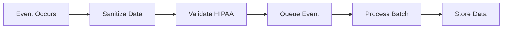

# Event Tracking Architecture

## 1. Event Structure
```typescript
interface AnalyticsEvent {
  eventId: string;
  category: 'user' | 'clinical' | 'system' | 'security';
  action: string;
  timestamp: string;
  metadata: {
    sessionId?: string;
    userRole?: string;
    patientId?: string; // Hashed
    component?: string;
    duration?: number;
  };
  context: {
    environment: string;
    version: string;
    userAgent: string;
  };
}
```

## 2. Event Categories
1. **User Events**
   - Login/Logout
   - Feature Usage
   - Navigation Patterns
   - Template Selection
   - Documentation Creation

2. **Clinical Events**
   - Document Completion
   - Template Usage
   - Patient Interactions
   - Clinical Decision Points

3. **System Events**
   - Performance Metrics
   - Error Occurrences
   - API Latency
   - Resource Utilization

4. **Security Events**
   - Access Attempts
   - Permission Changes
   - Data Export Events
   - Security Alerts

## 3. Collection Process


## 4. Implementation Guidelines
```typescript
// Example implementation
const trackEvent = (event: AnalyticsEvent): void => {
  const sanitizedEvent = sanitizeEvent(event);
  if (validateHIPAACompliance(sanitizedEvent)) {
    queueEvent(sanitizedEvent);
  }
};
```
