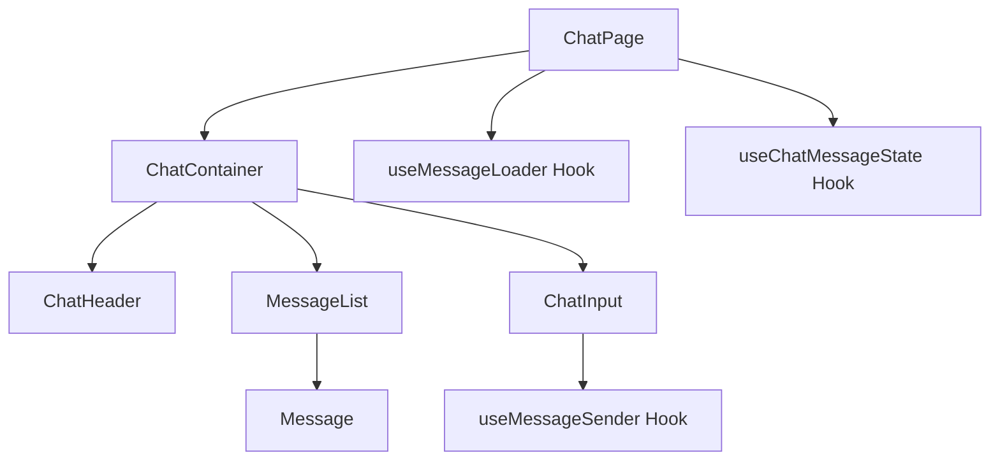

# Chat System Documentation: Message Pipeline and Context Management

## Component Hierarchy and Data Flow



## Message Pipeline Flow

### A. Message Input (ChatInput.tsx)
1. User enters message in `ChatInput` component
2. Component maintains internal state for:
   - Current message text
   - Loading state
   - Draft message handling
   - Direct mode toggle

### B. Message Sending (useMessageSender.ts)
1. Handles message submission through `handleMessageSend`
2. Creates optimistic message with:
   ```typescript
   {
     chatId: sessionId,
     content,
     type: 'text',
     role: 'user',
     status: 'pending',
     metadata: {
       tempId,
       isOptimistic: true,
       sortIndex: messages.length
     }
   }
   ```
3. Immediately adds optimistic message to UI
4. Sends request to Edge Function

### C. Edge Function Processing (direct-chat/index.ts)
1. Authentication and Validation
   - Verifies JWT token
   - Checks chat ownership
   - Validates input

2. Context Retrieval
   ```typescript
   {
     recentMessages: [], // Last 10 messages
     olderCount: 0      // Count of messages beyond last 10
   }
   ```

3. Message Context Formatting
   - Format includes:
     ```
     [Context: This conversation has X previous messages]
     
     === Previous Messages ===
     User: [message]
     Assistant: [message]
     
     === Current Message ===
     User: [current message]
     ```

4. **Important: o1-mini Model Limitation**
   - Cannot use system messages
   - Context must be included in user message
   - All context must be part of the single message

5. Message Storage
   - Stores user message
   - Makes OpenAI API call
   - Stores assistant response

### D. Real-time Updates (useMessageLoader.ts)
1. Subscribes to Supabase real-time updates
2. Listens for:
   - New messages
   - Message updates
   - Status changes

### E. State Management (useChatMessageState.ts)
1. Maintains:
   - Messages array
   - Loading state
   - Load attempts
   - Ready state

## Message Context Management

### A. Context Retrieval Process
```typescript
async function getChatContext(authenticatedClient, chatId) {
  // Get last 10 messages
  const { data: recentMessages } = await authenticatedClient
    .from('messages')
    .select('role, content, created_at')
    .eq('chat_id', chatId)
    .order('created_at', { ascending: false })
    .limit(10);

  // Get older messages count
  const { count } = await authenticatedClient
    .from('messages')
    .select('id', { count: 'exact', head: true })
    .eq('chat_id', chatId)
    .lt('created_at', lastMessage.created_at);

  return {
    recentMessages: recentMessages.reverse(),
    olderCount: count || 0
  };
}
```

### B. Context Formatting
```typescript
function formatContextualMessage(currentContent, recentMessages, olderCount) {
  let formattedContent = '';
  
  // Add context header
  if (olderCount > 0) {
    formattedContent += `[Context: ${olderCount} previous messages]\n\n`;
  }
  
  // Add recent messages
  formattedContent += recentMessages
    .map(msg => `${msg.role === 'user' ? 'User' : 'Assistant'}: ${msg.content}`)
    .join('\n\n');
    
  // Add current message
  formattedContent += `\n\nUser: ${currentContent}`;
  
  return formattedContent;
}
```

## Error Handling and Recovery

1. Message Send Failures
   - Keeps optimistic message with error state
   - Shows toast notification
   - Allows retry

2. Context Retrieval Failures
   - Falls back to no context
   - Logs error details
   - Continues with current message only

3. Real-time Connection Issues
   - Attempts reconnection
   - Falls back to polling if needed
   - Maintains local state

## Performance Considerations

1. Message Batching
   - Limits to 10 recent messages
   - Uses count-only query for older messages
   - Efficient pagination

2. Real-time Updates
   - Uses Supabase channels
   - Optimistic updates
   - Proper cleanup on unmount

3. Context Management
   - Efficient query patterns
   - Proper indexing
   - Minimal processing overhead

## Important Constraints

1. o1-mini Model Limitations
   - No system messages
   - Single message context
   - Context must be part of user message

2. Edge Function Limits
   - 10-second timeout
   - Memory constraints
   - Proper error handling needed

## Version History

### v1.0.0 (Initial Documentation)
- Documented complete message pipeline
- Added context management details
- Included error handling procedures
- Noted performance considerations
- Listed key constraints and limitations

