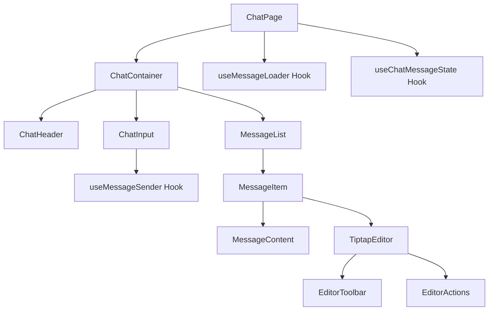

# Message Pipeline Overview

## Component Hierarchy

For detailed documentation on specific aspects of the message pipeline, see:

- [UI Components](./components/README.md)
- [Message Processing](./processing/README.md)
- [State Management](./state/README.md)
- [Error Handling](./error-handling/README.md)
- [Performance](./performance/README.md)

## Version History

### v3.0.0 (Current)
- Reorganized documentation into focused sections
- Enhanced component documentation
- Added detailed implementation guides

### v2.0.0
- Added comprehensive UI component documentation
- Detailed message interaction features
- Enhanced error handling documentation
- Added performance optimization details
- Expanded real-time update documentation

### v1.0.0 (Initial Documentation)
- Basic message pipeline documentation
- Context management details
- Initial error handling procedures
- Basic performance considerations
- Core constraints and limitations
