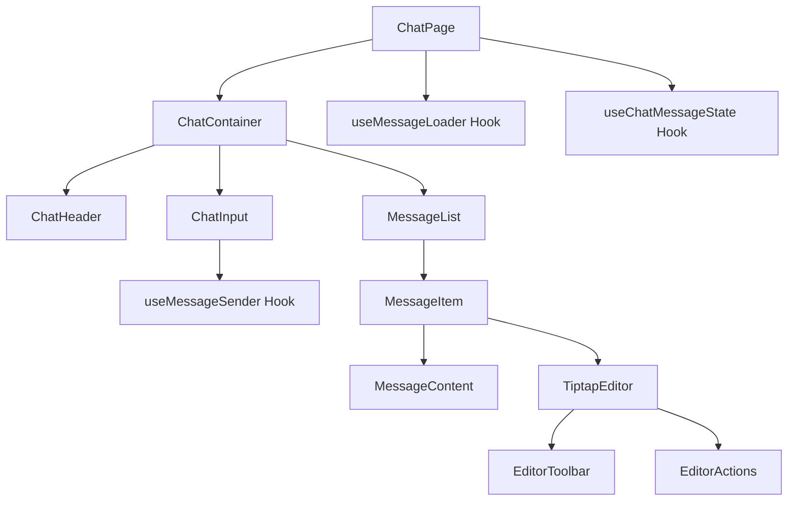

# Chat System Documentation: Message Pipeline and Context Management

## Component Hierarchy and Data Flow



## Message Pipeline Flow

### A. Message Input System
1. User Input Handling (`ChatInputField.tsx`)
   - Dynamic textarea resizing (40px to 200px)
   - Loading state management
   - Draft message persistence
   - Enter key submission (without shift)
   - Customized scrollbar styling
   - Placeholder text configuration

2. Input Actions (`ChatInputActions.tsx`)
   - File upload integration
   - Audio recording capability
   - Direct/Context mode toggle
   - Loading state visualization
   - Tooltip-enhanced buttons
   - Error state handling

### B. Message Sending Pipeline
1. Message Preparation (`useMessageSender.ts`)
   ```typescript
   {
     chatId: sessionId,
     content,
     type: 'text' | 'audio',
     role: 'user',
     status: 'pending',
     metadata: {
       tempId,
       isOptimistic: true,
       sortIndex: messages.length
     }
   }
   ```
2. Optimistic Updates
   - Immediate UI feedback
   - Temporary ID assignment
   - Status tracking
   - Sort index management

### C. Message Rendering System
1. Core Message Components
   - `MessageContent`: Markdown processing with remarkGfm
   - Custom styling for code blocks, links, tables
   - Role-based styling (user vs assistant)
   - Audio message indicators
   - Edit status display

2. Rich Text Editing
   - TiptapEditor integration with StarterKit
   - Toolbar with formatting options:
     - Bold/Italic text
     - Bullet/Ordered lists
     - Code blocks
     - Heading levels
   - Save/Cancel actions
   - Edit state management

3. Message Styling
   - User messages:
     ```css
     bg-gray-700/50
     rounded-[20px]
     px-4 py-2
     inline-block
     ```
   - Assistant messages:
     ```css
     prose prose-invert
     max-w-none
     space-y-6
     ```

### D. Message Interaction Features
1. Copy Functionality
   - Clipboard API integration
   - Success/failure feedback
   - Visual transitions
   - Haptic feedback (mobile)
   - Toast notifications

2. Audio Processing
   - 30-second chunk handling
   - Progress tracking
   - Multi-stage feedback
   - Memory management
   - Performance optimization

### E. Edge Function Processing
1. Authentication and Validation
   - JWT token verification
   - Chat ownership checks
   - Input validation

2. Context Management
   ```typescript
   {
     recentMessages: [], // Last 10 messages
     olderCount: 0      // Count of messages beyond last 10
   }
   ```

3. Context Formatting
   ```typescript
   [Context: This conversation has X previous messages]
   
   === Previous Messages ===
   User: [message]
   Assistant: [message]
   
   === Current Message ===
   User: [current message]
   ```

### F. Real-time Updates
1. Supabase Subscription Management
   - New message handling
   - Status updates
   - Error recovery
   - Connection management

2. State Synchronization
   - Optimistic updates
   - Server reconciliation
   - Error state recovery
   - Loading state management

## Message Context Management

### A. Context Retrieval Process
```typescript
async function getChatContext(authenticatedClient, chatId) {
  // Get last 10 messages
  const { data: recentMessages } = await authenticatedClient
    .from('messages')
    .select('role, content, created_at')
    .eq('chat_id', chatId)
    .order('created_at', { ascending: false })
    .limit(10);

  // Get older messages count
  const { count } = await authenticatedClient
    .from('messages')
    .select('id', { count: 'exact', head: true })
    .eq('chat_id', chatId)
    .lt('created_at', lastMessage.created_at);

  return {
    recentMessages: recentMessages.reverse(),
    olderCount: count || 0
  };
}
```

### B. Context Formatting
```typescript
function formatContextualMessage(currentContent, recentMessages, olderCount) {
  let formattedContent = '';
  
  // Add context header
  if (olderCount > 0) {
    formattedContent += `[Context: ${olderCount} previous messages]\n\n`;
  }
  
  // Add recent messages
  formattedContent += recentMessages
    .map(msg => `${msg.role === 'user' ? 'User' : 'Assistant'}: ${msg.content}`)
    .join('\n\n');
    
  // Add current message
  formattedContent += `\n\nUser: ${currentContent}`;
  
  return formattedContent;
}
```

## Error Handling and Recovery

1. Message Send Failures
   - Optimistic message preservation
   - Error state visualization
   - Toast notifications
   - Retry capability

2. Context Retrieval Issues
   - Graceful degradation
   - Error logging
   - Fallback to current message
   - Recovery attempts

3. Real-time Connection Problems
   - Automatic reconnection
   - Fallback to polling
   - Local state preservation
   - Error notifications

## Performance Considerations

1. Message Optimization
   - 10-message batch limit
   - Efficient count queries
   - Pagination support
   - Memory management

2. Real-time Updates
   - Supabase channels
   - Optimistic rendering
   - Proper cleanup
   - Connection monitoring

3. Context Efficiency
   - Query optimization
   - Index utilization
   - Processing overhead reduction
   - Memory usage monitoring

## Important Constraints

1. Model Limitations
   - No system messages
   - Single message context
   - Context in user message

2. Edge Function Constraints
   - 10-second timeout
   - Memory limits
   - Error handling requirements
   - Connection management

## Version History

### v2.0.0 (Current)
- Added comprehensive UI component documentation
- Detailed message interaction features
- Enhanced error handling documentation
- Added performance optimization details
- Expanded real-time update documentation

### v1.0.0 (Initial Documentation)
- Basic message pipeline documentation
- Context management details
- Initial error handling procedures
- Basic performance considerations
- Core constraints and limitations

